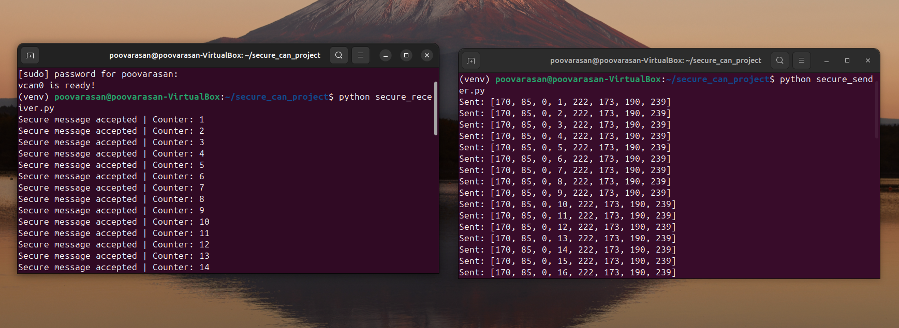
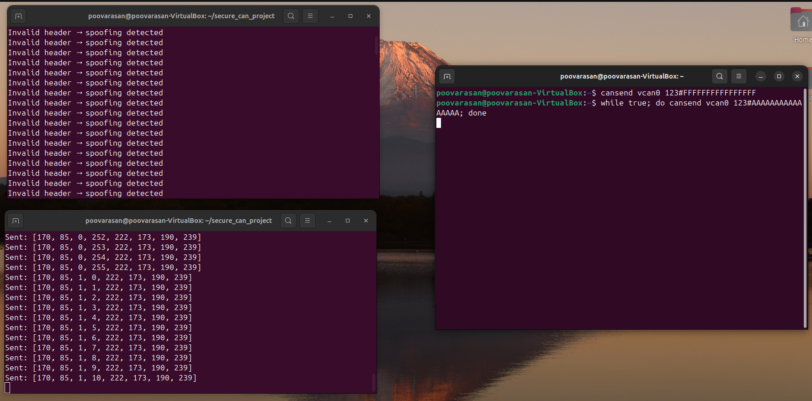
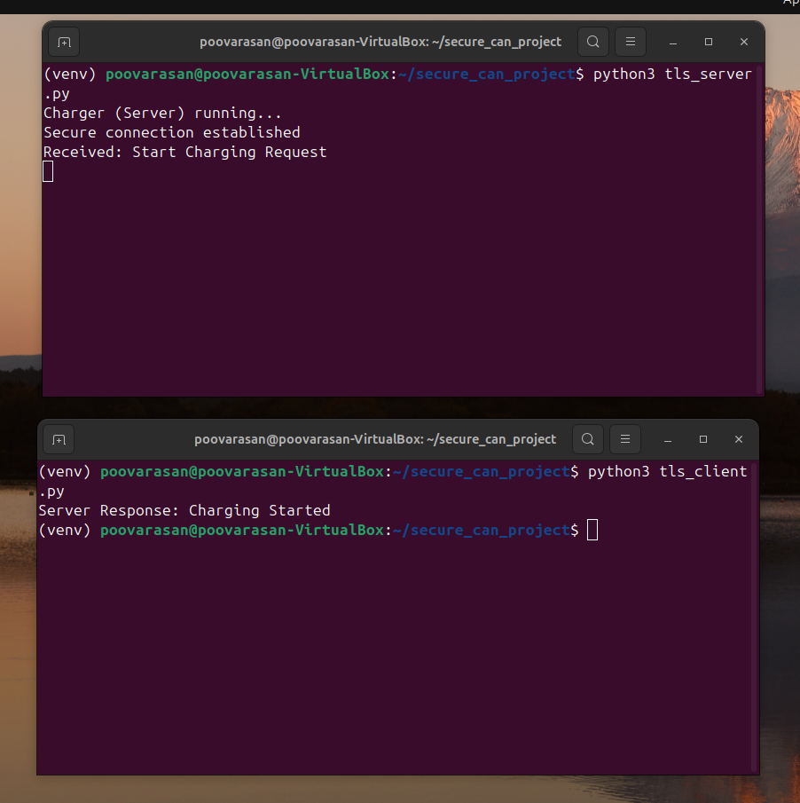
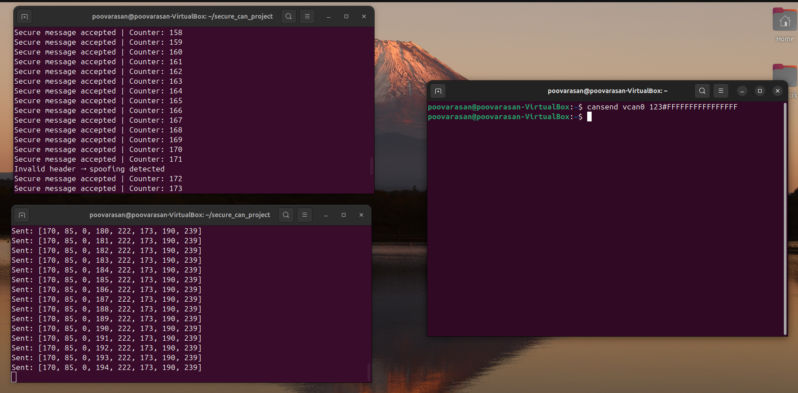
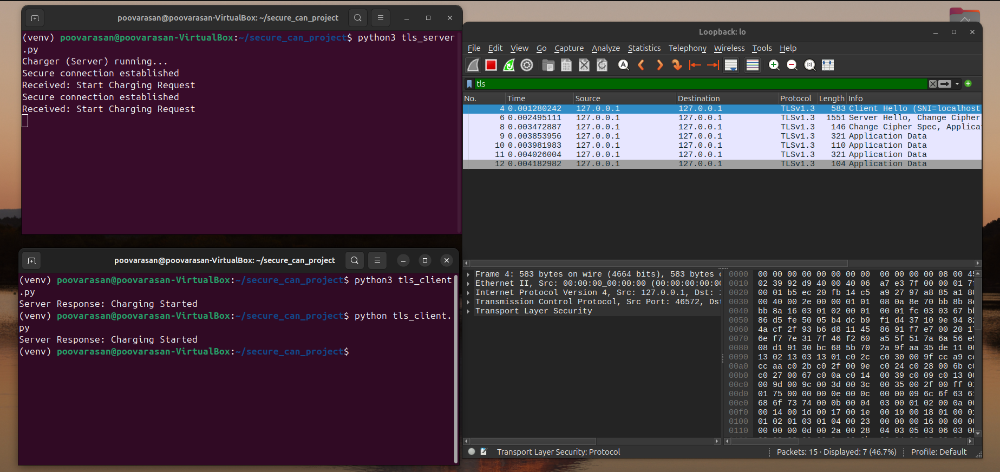

# Secure CAN and V2G Communication System for EV

## Overview

This project presents a simulation-based automotive cybersecurity framework focused on securing Controller Area Network (CAN) communication and Vehicle-to-Grid (V2G) communication in electric vehicles.

The system demonstrates vulnerabilities in traditional CAN networks and implements security mechanisms such as:

- Message authentication
- Replay protection
- Spoofing attack detection
- Denial of Service (DoS) attack simulation
- TLS-based encrypted V2G communication

The project was developed as part of the **Network and Communication for Connected Vehicles** elective subject.

---

# Objectives

- Simulate secure CAN communication using SocketCAN
- Detect spoofing, replay, and DoS attacks
- Implement authentication mechanisms for CAN messages
- Secure Vehicle-to-Grid communication using TLS
- Analyze encrypted traffic using Wireshark
- Demonstrate practical automotive cybersecurity concepts

---

# Project Architecture

```text
                     +---------------------------+
                     |      Virtual CAN (vcan0) |
                     +---------------------------+
                              |
         -------------------------------------------------
         |                                               |
+-------------------+                     +-----------------------+
| Secure CAN Sender |                     | Secure CAN Receiver   |
|     (Python)      |-------------------> |  Validation Engine    |
+-------------------+                     +-----------------------+
                                                     |
                                                     v
                                       +---------------------------+
                                       | Attack Detection Module   |
                                       | Spoofing / Replay / DoS   |
                                       +---------------------------+

==================================================================

                Vehicle-to-Grid (V2G) Communication

+-------------------+        TLS Encrypted       +------------------+
| EV Client System  | <------------------------> | Charging Server  |
|   (Python TLS)    |                            |   (Python TLS)   |
+-------------------+                            +------------------+

==================================================================

Supporting Technologies:
- Python
- SocketCAN
- OpenSSL
- Wireshark
- Linux Virtual CAN Interface
```

---

# Features

## Secure CAN Communication

- Virtual CAN interface using SocketCAN
- Secure message transmission
- Counter-based authentication
- Replay protection mechanism
- Message integrity validation

---

## Attack Detection

- Spoofing attack detection
- Replay attack detection
- DoS attack simulation
- Invalid frame identification

---

## Secure V2G Communication

- TLS-based encrypted communication
- Secure client-server architecture
- Authentication using OpenSSL
- Encrypted charging request simulation

---

## Packet Analysis

- TLS handshake verification
- Encrypted packet inspection using Wireshark
- Traffic monitoring and validation

---

# Folder Structure

```text
secure-can-and-v2g-communication-system-for-ev/
│
├── can_system/
│   ├── secure_sender.py
│   ├── secure_receiver.py
│   ├── encryption_demo.py
│   ├── attack.py
│   ├── start_can.sh
│   ├── secure_sender.py.save
│
├── tls_v2g/
│   ├── tls_server.py
│   ├── tls_client.py
│   │
│   └── certificates/
│       ├── ca.crt
│       ├── ca.key
│       ├── charger.crt
│       ├── charger.key
│       ├── charger.csr
│       ├── ev.crt
│       ├── ev.key
│       └── ev.csr
│
├── screenshots/
│   ├── can_communication.png
│   ├── DOS attack.png
│   ├── encryp_handshake.png
│   ├── spoofing_attack.png
│   └── wireshark_verification.png
│
├── requirements.txt
├── README.md
```

---

# Installation Guide

## Prerequisites

Before running the project, install the following:

- Ubuntu/Linux
- Python 3.x
- SocketCAN
- OpenSSL
- Wireshark

---

# Install Required Packages

```bash
sudo apt update

sudo apt install can-utils python3 python3-pip openssl wireshark
```

---

# Clone Repository

```bash
git clone https://github.com/poovarasan46/secure-can-and-v2g-communication-system-for-ev.git

cd secure-can-and-v2g-communication-system-for-ev
```

---

# Install Python Dependencies

```bash
pip install -r requirements.txt
```

---

# Requirements File

## requirements.txt

```txt
python-can
cryptography
pyopenssl
```

---

# Setup Virtual CAN Interface

```bash
sudo modprobe vcan

sudo ip link add dev vcan0 type vcan

sudo ip link set up vcan0
```

Verify the interface:

```bash
ifconfig vcan0
```

---

# Usage Instructions

## Run Secure CAN Receiver

```bash
python3 secure_receiver.py
```

---

## Run Secure CAN Sender

```bash
python3 secure_sender.py
```

---

## Run Attack Simulation

```bash
python3 attack.py
```

This script is used for:
- Spoofing attack simulation
- Replay attack simulation
- CAN traffic manipulation

---

## Run Encryption Demonstration

```bash
python3 encryption_demo.py
```

This demonstrates:
- Secure payload encryption
- Encrypted CAN data handling
- Message confidentiality concepts

---

## Run TLS Charging Server

```bash
python3 tls_server.py
```

---

## Run TLS EV Client

```bash
python3 tls_client.py
```

---

# Attack Simulation Explanation

## Spoofing Attack

Unauthorized CAN frames are injected into the network using fabricated headers or IDs.

The receiver validates incoming messages and rejects invalid packets.

### Detection Methods

- Header validation
- Message structure verification
- Invalid sender detection

---

## Replay Attack

Previously captured CAN messages are retransmitted to mimic legitimate communication.

### Detection Methods

- Counter validation
- Sequence checking
- Freshness verification

---

## Denial of Service (DoS) Attack

A large number of CAN frames are continuously transmitted to flood the network.

### Impact

- Network congestion
- Delayed packet delivery
- Reduced communication efficiency

---

# Screenshots

## CAN Communication

The following screenshot demonstrates secure CAN communication between the sender and receiver using the virtual CAN interface (`vcan0`).





---

## Denial of Service (DoS) Attack Simulation

This screenshot shows CAN bus flooding during the DoS attack simulation.





---

## TLS Encrypted Handshake

The following screenshot demonstrates secure TLS handshake establishment between the EV client and charging server.





---

## Spoofing Attack Detection

This screenshot shows spoofed CAN frames being detected and rejected by the secure receiver.





---

## Wireshark TLS Verification

The captured packets below demonstrate TLS handshake verification and encrypted application data analysis using Wireshark.





---

# Results

The project successfully demonstrates:

- Secure CAN communication using authentication mechanisms
- Detection of spoofing attacks
- Replay attack prevention
- Impact analysis of DoS attacks
- TLS-encrypted V2G communication
- Packet-level encryption verification using Wireshark

---

## Wireshark Analysis Confirmed

- TLS handshake exchange
- Encrypted application data
- No plaintext communication

---

# Technical Workflow

```text
CAN Sender
    |
    v
Message Encryption + Counter Addition
    |
    v
Virtual CAN Interface (vcan0)
    |
    v
Receiver Validation
    |
    +----> Counter Verification
    |
    +----> Header Validation
    |
    +----> Replay Detection
    |
    +----> Spoofing Detection
    |
    v
Accepted / Rejected Message

======================================================

EV Client
    |
TLS Secure Channel
    |
Charging Station Server
    |
Encrypted Charging Communication
    |
Wireshark Verification
```

---

# Future Improvements

- Integration with real CAN hardware
- Intrusion Detection Systems (IDS)
- Machine learning-based anomaly detection
- Secure OTA firmware updates
- Blockchain-based V2G authentication
- AUTOSAR integration
- Real-time attack mitigation
